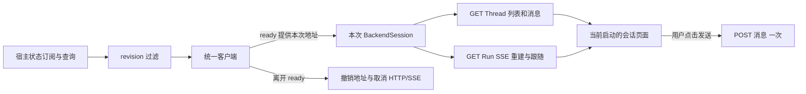

# 让业务 HTTP/SSE 请求跟随本次后端切换

Status: done

## Parent

[Windows 桌面应用与后端生命周期 PRD](../PRD.md)。本票范围服从 PRD 的最终接口契约；ready-for-agent 表示信息可实施，代码仍由用户主导，助手实现需另行委托。

## What to build

页面的业务请求只连接本次 ready 后端；重试换端口后正确重取历史与运行状态，不显示旧启动内容，也不自动重复副作用。

**接口与设计原因：** 统一 HTTP/SSE 客户端消费 get_backend_state、backend-state-changed 的 startup_id、revision、base_url；通过现有 Thread、消息及 Run HTTP/SSE API 读取真实业务状态。

## Acceptance criteria

- [x] 页面先订阅再查询状态，初次接收后仅接受更新 revision；所有业务请求从统一客户端取得当前 ready 地址，不各自硬编码端口。
- [x] 离开 ready 撤销地址、停止新请求并清理旧连接；旧启动的迟到响应和 SSE 事件不能写入新启动页面。
- [x] 重试成功后切换实际地址，重新取得 Thread、消息与 Run 状态，显示恢复后的持久事实。
- [x] 刷新页面复用已运行后端；重试不自动重发用户消息、不重新执行失败 Run。
- [x] 通过真实业务读取及 SSE 验证地址切换、持续连接断开、请求迟到和快照查询交错；使用确定性任务而非真实模型网络调用。
- [x] 本票只完成生命周期所需的数据连接和恢复行为，不扩大为前端视觉重设计或其他 UI 功能。

## Blocked by

- [故障后手动重试，并隔离新旧启动](06-manual-retry-isolation.md)

## Comments

- 2026-09-28：按用户确认的 10 票拆分发布。对应验收随本票完成，记录自动测试、Windows 原生验证与未验证项；不得将模拟进程结果代替平台验证。

## 实现说明（2026-10-02）

审查固定基线：`74cb0c5410f6060ba639beffb7017834d8bfe2bc`。本票由用户明确委托实现。助手未执行暂存、提交或其他 Git 写操作；执行期间观察到部分中间改动已进入暂存区，后续修正只写工作区。

### 做什么、为什么、用什么 API

| 做什么 | 为什么 | API / 位置 |
| --- | --- | --- |
| 统一持有当前后端地址及其有效期 | 离开 ready 后，保留旧引用的调用者也不能继续请求 | [BackendClient / BackendSession](../../../frontend/src/backend-client.ts)，`AbortController`、`AbortSignal.any()`、`fetch` |
| 在宿主回调中同步切换客户端，再更新 React | 取消请求无需等待 React 下一次渲染 | [useBackendState](../../../frontend/src/useBackendState.ts)，复用先订阅后查询及 revision 过滤 |
| 读取真实会话、消息与当前 Run | 后端重试后以恢复后的持久事实重建页面 | [useConversations](../../../frontend/src/useConversations.ts)，现有 Thread HTTP 与 Run 只读 SSE |
| 用当前启动标识隔离页面业务状态 | 新旧启动的组件、草稿和未完成请求不混用 | [App](../../../frontend/src/App.tsx)，`Workspace key={startupId}` |
| 接入现有新建与发送按钮 | 业务副作用由用户显式触发；重试与刷新只恢复读取 | `POST /api/threads`、`POST /api/threads/{id}/stream` |
| 开放桌面页面的跨域访问 | WebView 来源与动态 Python 端口不同 | [app/desktop.py](../../../app/desktop.py)，`CORSMiddleware` |



### 地址与迟到结果如何隔离

1. 页面继续使用 `subscribeBackendState()`，订阅完成后查询当前宿主；事件、查询和重试回复共用 revision 次序。
2. 接受快照时，先调用 `client.update()`。离开 ready 或启动标识/地址改变就撤销旧 session、取消全部旧请求；随后才更新 React 快照。
3. 每个请求绑定启动取消信号；会话切换再叠加自己的取消信号。JSON 完整读取后、每条 SSE 投递前都检查信号。即使网络适配器忽略取消、数据已经排队，旧结果也不能交给页面。
4. SSE 读取器在取消或结束时释放；已经撤销后才到达的响应体也会关闭。即使新后端复用同一个端口，旧 session 仍保持失效。
5. 新启动挂载新的业务页面，重新请求列表，选择最近更新的 Thread，读取其消息，并从最后一条消息的 `run_id` 通过只读 SSE 重建当前 Run。页面刷新同样只查询现有宿主和业务事实。

SSE 使用 `fetch` 的流式响应体读取 UTF-8，支持同一客户端中的 POST 发送流和 GET 观察流。完整消息按持久序号去重并覆盖预览增量；Run 状态以 `metadata` 为准。只读流首帧给出当前状态，后续还会重放历史审批及生命周期事件，因此旧暂停记录不会覆盖当前已恢复的 running 状态。

新建与发送只有按钮/快捷操作触发。发送结束或连接异常后只重新 GET 消息和 Run；重试、刷新和重新订阅都不重发消息、不执行失败 Run。切换会话关闭观察连接，不取消服务端任务。

页面沿用已有布局，增加真实内容、当前 Run ID/状态/用量、读取错误和“刷新数据”。浏览器直接打开页面仍可预览示例，业务发送需要桌面 ready 地址。审批提交界面没有在本票新增，现有中断状态可显示。

### CORS

桌面入口仅允许本项目当前开发来源 `http://127.0.0.1:5173` 和 Windows 应用来源 `http://tauri.localhost`，方法为 GET/POST，请求头允许 Content-Type。普通 HTTP/CLI 入口保持原配置。来源的协议、主机和端口必须匹配，依据 [FastAPI CORS 文档](https://fastapi.tiangolo.com/tutorial/cors/)；Windows 默认应用协议来源依据 [Tauri 配置文档](https://v2.tauri.app/reference/config/)。

## 验收证据

沿用 PRD 已确认的客户端公开交互、HTTP/SSE 与 Windows 原生边界；确定性模型及可控工具替代外部模型服务，runtime、持久化、HTTP、WebView 与宿主进程实际运行。

### 红绿过程

1. 统一客户端测试先因缺少客户端实现失败；实现后验证真实本机 HTTP 地址切换、持续 SSE 断开和旧状态查询隔离。
2. 实际窗口先无法显示后端已保存的会话；接入真实读取、CORS 和发送后通过。原生验收同时发现并修正了浏览器 `fetch` 的调用绑定问题。
3. 延迟响应测试发现：旧启动已撤销后才到达的 SSE 响应体没有关闭。补充释放后通过；JSON 与排队事件仍被丢弃。
4. Spec 审查发现历史审批暂停可覆盖当前 running。真实审批恢复用例先复现错误页面，再改为仅由 metadata 更新状态后通过。保留[红灯日志](../test-results-09-replay-red.log)。

### 本票 Windows 场景

| 场景 | 真实可观察结果 |
| --- | --- |
| 历史读取与显式发送 | 后端保存消息后刷新页面，显示真实消息及 completed Run；从页面发送后只出现一条对应用户消息，宿主/Python 数量仍为 1/1。开发及应用来源预检通过，其他来源预检拒绝 |
| 运行中刷新与换端口 | 用户通过页面新建并发送，模型阻塞时刷新仍显示同一 running Run；强杀 Python 并占住旧端口后手动重试，使用新地址，显示恢复后的 error；旧 SSE 的取消信号触发，刷新及重试后的业务请求全部为 GET，持久库中仍只有一个 Run 和一条用户消息 |
| 真实历史响应迟到 | 在 fetch 边界延迟已经从真实服务器解析出的旧消息；创建更新的 Thread 后强杀并换端口重试。新页面读取新 Thread；释放旧响应后，旧内容没有覆盖当前页面 |
| 审批恢复历史重放 | 通过真实 HTTP 审批恢复同一个 Run，工具仍执行时刷新页面；历史 interrupted 不覆盖当前 running，释放工具后实时到达 completed |

网络记录只统计 `/api/` 业务请求，避免将 Tauri 自身的 IPC POST 混入“消息重发”判断。延迟交付发生在验收脚本的传输边界，生产代码没有故障注入开关。

结果 JSON 和截图见 [client-acceptance](../client-acceptance/)；截图已检查真实消息和恢复错误的可读性。既有 Windows 用例的本轮结果写到 [client-regression](../client-regression/)，保留第 07、08 票原始证据。

## Standards

做得好：地址撤销集中在客户端，页面、会话与传输职责清楚；测试通过真实 HTTP/Windows 边界观察行为。

需要修：无仓库文档规范硬性违例。

值得讨论：审查提出 1 项低优先级重复条件建议——发送按钮和发送入口各自表达许可。已统一为 `canSend`，入口额外保留即时撤销检查和 ref 防重入，复核关闭。

## Spec

做得好：同步撤销地址、请求与 SSE 隔离、真实历史恢复、刷新复用宿主和不重发均有实现与实际窗口证据。

需要修：1 项 P2——重放历史审批事件可能使已恢复的 running 显示为 interrupted。已修复，并通过真实审批恢复回归。

值得讨论：通过现有只读 Run SSE 获取状态，没有增加 Run 查询接口或审批 UI。

审查汇总：Standards 硬违例 0、未关闭建议 0；Spec 原 1 项 P2 已修复并复核关闭，剩余问题 0 项。

## 最终验证结果

| 检查 | 结果与日志 |
| --- | --- |
| Windows 联合验收 | 24 项全部通过，127.643 秒：本票 4 项、进程归属 6 项、单实例 6 项、托盘 8 项；[完整日志](../test-results-09-windows-all.log) |
| Python 全套 | 262 项中 261 通过、1 跳过，225.994 秒；[日志](../test-results-09-python.log)。跳过原有 Windows 符号链接权限用例 |
| Rust 全套 | 串行 19 项全部通过；[日志](../test-results-09-rust.log) |
| 前端客户端 | 8 项全部通过：原状态订阅/重试 5 项、本票传输隔离 3 项；[日志](../test-results-09-client.log) |
| TypeScript / Vite | `pnpm build` 通过；[日志](../test-results-09-build.log) |
| 静态检查 | 变更 Python 文件与联合验收脚本的 Ruff/格式检查、相对文档链接及固定基线 `git diff --check` 通过 |

验收脚本调试中修正了两点：先启用 CDP Page 域，再注册页面初始化脚本；记录业务请求时过滤掉 Tauri IPC POST。发送操作也等待异步新建会话完成，避免测试把草稿写到尚未创建的会话。修正后联合 24 项一次运行全绿。

执行期间环境改为受限模式后，原生 WebView 调试连接和 Node 构建曾受阻。窗口测试改在真实桌面会话运行，停滞构建仅清理已核实属于本任务的进程后重试；最终构建和验收均完成，没有留下环境阻塞。

收尾检查没有残留 `backend_window` / `backend_host` 进程，5173 和 9238 端口均已释放。

## 复现

先在 `frontend` 执行 `pnpm build`，在 `frontend/src-tauri` 构建 `cargo build --offline --example backend_host --example backend_window`。从仓库根运行：

```powershell
node --test frontend/tests/*.test.mjs
.venv/Scripts/python.exe -X utf8 -m unittest discover -s frontend/src-tauri/tests -p client_acceptance.py -v
.venv/Scripts/python.exe -X utf8 .scratch/windows-backend-lifecycle/run-09-windows.py
```

最后一条联合运行全部 Windows 验收并将旧票回归证据转存到本票目录。需要真实 Windows 桌面会话、空闲的 5173/9238 端口；后端从 45200 起尝试。测试会显示隔离窗口及托盘菜单，结束后释放本次进程及临时数据。

本票验证了实际 Windows 开发态 WebView 与 Python 后端；应用来源另做 CORS 预检验证。没有将这些结果宣称为安装包分发、macOS 或 Linux 原生验收。第 10 票日志查询仍待实现。
