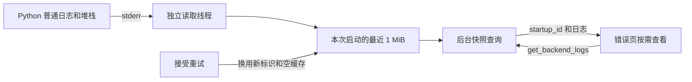

# 在错误页查看本次启动的有限日志

Status: done

## Parent

[Windows 桌面应用与后端生命周期 PRD](../PRD.md)。本票范围服从 PRD 的最终接口契约；ready-for-agent 表示信息可实施，代码仍由用户主导，助手实现需另行委托。

## What to build

用户可按需查看当前启动的后端日志定位故障；大量输出不会拖垮内存或阻塞清理，重试后不会混入上一轮日志。

**接口与设计原因：** Rust 持续消费 stderr 并维护最近 1 MiB，get_backend_logs 返回带 startup_id 的日志快照；错误页按需读取并校验归属。

## Acceptance criteria

- [x] 内存仅保留最近 1 MiB stderr，面对持续洪泛仍有界并持续排空管道；返回内容处理 UTF-8 截断边界，不因坏日志阻塞生命周期。
- [x] get_backend_logs 返回本次 startup_id 和日志快照；页面只显示与当前启动匹配的结果，查询返回期间发生重试也不污染新页面。
- [x] 接受新启动时清空旧日志，迟到旧输出被隔离；应用退出后不持久保存本功能的日志缓存。
- [x] 日志读取失败不影响错误原因、退出、进程回收或手动重试；日志查看不能成为清理前置条件。
- [x] 验证 stderr 洪泛、重试时迟到输出、旧查询迟到和读取失败；错误页能定位真实 startup_error 或运行异常，同时保持退出正常。
- [x] stdout 继续仅承载受限结构化协议，普通日志和堆栈走 stderr；错误说明不输出配置密钥值。

## Blocked by

- [故障后手动重试，并隔离新旧启动](06-manual-retry-isolation.md)

## Comments

- 2026-09-28：按用户确认的 10 票拆分发布。对应验收随本票完成，记录自动测试、Windows 原生验证与未验证项；不得将模拟进程结果代替平台验证。
- 2026-10-02：用户委托完成第 10 票。以开始时的干净提交 `68633d3f6f5c6d6feb1a3ec018d45e0506a1930d` 为审查基线；实现、双轴审查、本票 5 个真实窗口场景及全套回归完成，状态更新为 `done`。

## 实现说明

### 做什么、为什么、用什么 API

| 做什么 | 为什么 | API / 位置 |
| --- | --- | --- |
| 每次启动持有独立的最近 1 MiB stderr 缓存 | 洪泛有界，重试立即换掉旧缓存 | `StartupLogs`，`frontend/src-tauri/src/backend/logs.rs` |
| 后台持续读取管道，每次最多 8192 字节 | 不等待换行；一条超长日志也不能积累无界缓冲 | `File::read`、`VecDeque<u8>` |
| 按需查询日志快照 | 页面查询与进程退出判断分开 | `BackendManager::logs()`、Tauri `get_backend_logs` |
| 错误页查看、刷新本次日志 | 显示真实诊断，并在日志暂未到齐时允许再次读取 | `BackendLogs.tsx`、`invoke("get_backend_logs")` |
| 用启动标识隔离页面与查询 | 旧查询迟到不能覆盖新启动的诊断 | React `key={startup_id}`、请求代次、返回 `startup_id` 校验 |



### 宿主日志缓存

缓存固定保留最多 **1,048,576 个原始字节**，写入前先丢弃最早字节。每次读取独立于 stdout 控制协议，不需要换行，也不把日志排入生命周期消息队列。

`get_backend_logs` 返回：

| 字段 | 含义 |
| --- | --- |
| `startup_id` | 这份缓存所属的启动标识 |
| `text` | UTF-8 日志文本；截断边界和非法字节用 `�` 表示 |
| `retained_bytes` | 当前保留的原始字节数，最多 1 MiB |
| `truncated` | 是否已经丢弃较早字节 |
| `read_error` | 管道读取异常时的固定说明；正常时为空 |

1 MiB 限制针对原始 stderr 缓存。快照复制、UTF-8 替换字符和 IPC 序列化会使用额外的临时内存；坏字节转换成替换字符后，返回文本的 UTF-8 字节数可以大于 1 MiB。它不是对整个宿主进程内存的限制。

管理器只在短暂持有状态锁时取得当前缓存的 `Arc`，随后释放状态锁。快照复制使用单独的日志锁，UTF-8 解码在该锁外完成；Tauri 用 `spawn_blocking` 执行查询。退出、回收和重试均不读取日志锁，也不等待日志读线程结束。

接受重试时立即创建空缓存和新标识。旧读取线程只持有 `Weak` 引用，不能访问新缓存；旧缓存不再被管理器或正在执行的查询持有后即可释放。即使旧管道迟到输出，读取线程仍排空字节并丢弃，不长期保留上一轮缓存。

日志读取出错只设置 `read_error`，保留已经收到的尾部，不改变后端错误原因或重试资格。正常管道 EOF 结束读取。本功能不写日志文件；退出应用后缓存消失。

### 错误页与错误原因

有生命周期错误时显示“查看本次启动日志”。点击后才调用宿主；已读取后可“刷新日志”。页面显示启动标识、截断提示和可滚动的纯文本日志，不解释日志里的 HTML。

日志查询失败有自己的提示，保留原始后端错误。查询尚未返回也不禁用后端重试或托盘退出。重试切换标识时旧组件卸载，请求失效；新组件不继承旧日志、加载状态或错误。返回标识不匹配时不显示该结果，并提示重新读取。

原来 `backend_exit` 会把 stderr 尾部拼进主错误说明。本票改为简短原因及查看日志提示，使故障与诊断分别读取。结构化 `startup_error.code/message` 继续作为原始原因。

宿主为托管 Python 设置 `PYTHONIOENCODING=utf-8`，确保 Windows 普通文本输出可解码；外部工具产生的坏字节仍容错处理。stdout 的 64 KiB 逐行结构化协议及 Python 的普通 stdout 重定向保持既有契约。配置错误沿用共享配置解析器的脱敏说明，没有增加配置或环境变量转储。

## 验收证据

采用 PRD 已确认的管理器公开命令、客户端交互和 Windows 原生边界。

### 红绿过程

1. 管理器新测试先因缺少日志查询接口失败；增加缓存和 `logs()` 后，真实 Python 管道的 1 MiB 尾部及坏 UTF-8 场景通过。
2. 真实 Tauri 错误页测试先因缺少“查看本次启动日志”按钮失败；接入 command 与页面后，通过真实配置失败 traceback、密钥值不回显和重试清空检查。
3. 继续通过既定公开边界验证旧管道、读取失败、连续洪泛、查询迟到和退出；没有为缓存私有方法新增测试入口。

### Rust 管理器新增 4 项

| 场景 | 观察结果 |
| --- | --- |
| 超过 1 MiB，截断落在中文字符中间，末尾非法 UTF-8 | 返回精确的最近字节范围及替换字符，`retained_bytes=1048576`；退出成功 |
| 回收后旧管道仍保持打开并在重试后输出 | 新启动立即为空，只显示新管道内容；旧写入超过 OS 管道缓冲仍能完成 |
| stderr 提供写入专用句柄，触发真实读错误 | 日志读取状态报错，原 `RuntimeDataInUseError` 保留；可重试、就绪并退出 |
| 连续无间断 stderr 输出，同时多次读取快照 | 缓存持续有界，启动和退出均取得进展 |

这些测试经 `BackendManager` 公开接口观察结果，Python 子进程、Job 及控制管道真实运行。旧管道和读错误用例仅在 `ManagedProcess::take_stdio` 这一 OS 边界替换 stderr 句柄；不把这种注入当作真实平台自发故障。

### Windows / WebView 新增 5 项

| 场景 | 观察结果 |
| --- | --- |
| 真实 `AppConfigError` | 错误页按需显示 traceback 和启动标识；非法 transport 使用的测试密钥值没有出现在页面；修复配置并重试后旧日志消失 |
| 旧查询迟到及返回归属不符 | 已取得的旧 Rust 日志响应跨重试延迟交付，新错误日志不被覆盖；错误 startup_id 的内容不显示 |
| IPC 返回失败、查询一直不返回 | 显示独立日志错误；后端原错误不变；待决查询期间仍可重试和从托盘退出 |
| 实际 Python 持续输出中文及非法字节 | 查询确认保留 1 MiB、显示替换字符；触发初始化异常后，主进程和测试后代均已回收，错误页可读取截断日志 |
| 就绪后 Python 意外退出 | stderr 诊断可从错误页读取，主错误保持 `backend_exit`；测试后代被回收，宿主可正常退出 |

原生场景使用隔离项目、临时数据库、真实 Tauri/WebView、真实 Python 和托盘菜单。模型边界使用确定性 fixture，无需联网生成内容。IPC 迟到、失败及挂起只在测试的 `fetch` 传输边界注入，成功响应仍来自实际 Rust 快照。

验收脚本修正了两项测试设施问题：Tauri 的 `invoke` 属性不可直接改写，因此在 IPC 传输响应处注入；洪泛检查在 WebView 内判定内容并仅返回小摘要，避免调试 WebSocket 自身的 1 MiB 帧限制。生产接口仍返回完整受限日志快照。

完整回归首轮还有 16 项在托盘菜单的悬停等待处失败：菜单重复出现在同一坐标，鼠标位置未改变，脚本没有可靠产生新的悬停通知。另 1 项是独立 HTTP 对照进程清理时数据库尚占用。已修正共享验收设施：先移动到菜单项另一位置再移动到中心；独立服务直接启动基础 Python（脚本已显式加载项目 site-packages），使 `kill/wait` 面向实际 HTTP 进程，避免只结束 Windows 虚拟环境转发进程。保留[首次联合运行记录](../test-results-10-windows-initial.log)。修正没有改变应用退出路径，也没有绕过真实菜单点击或进程回收断言。

本票结果与截图见 [log-acceptance](../log-acceptance/)，旧票本轮回归见 [log-regression](../log-regression/)。测试证据文件由验收脚本显式保存，与产品“不持久保存日志缓存”的行为不同。

## Standards

做得好：日志锁与生命周期状态锁分离，锁外解码；旧读线程弱引用缓存；组件按启动重新挂载并校验结果；测试通过真实进程、OS 管道和 IPC 边界观察行为。

需要修：无违反仓库约定的硬性问题。

值得讨论：无需要重构的 smell 建议。测试的 `WithStderr` 转发其他平台操作，是为了替换 stderr 这一明确的 OS 边界。

## Spec

做得好：1 MiB 原始字节上限、持续排空、坏 UTF-8、启动归属、旧查询隔离和日志失败不阻碍生命周期均有实现及对应验收；stdout 协议限制保持。

需要修：未发现遗漏、错误实现或范围扩张。

值得讨论：没有新增设计议题。

双轴审查：Standards 硬问题 0、建议 0；Spec 问题 0。审查不代替实际测试，最终结果见下表。

## 最终验证结果

| 检查 | 结果与日志 |
| --- | --- |
| Windows 联合验收 | 29 项全部通过，155.323 秒：本票 5 项、业务客户端 4 项、进程归属 6 项、单实例 6 项、托盘 8 项；[完整日志](../test-results-10-windows-all.log) |
| Python 全套 | 262 项中 261 通过、1 跳过，224.459 秒；[日志](../test-results-10-python.log)。跳过原有 Windows 符号链接权限用例 |
| Rust 全套 | 串行 23 项全部通过，含本票新增 4 项；[日志](../test-results-10-rust.log) |
| 前端客户端 | 8 项全部通过；[日志](../test-results-10-client.log)。本票页面交互另由上面的 5 项 Windows 用例验证 |
| TypeScript / Vite | `pnpm build` 通过；[日志](../test-results-10-build.log) |
| 原生宿主构建 | `cargo build --offline --examples` 通过；[日志](../test-results-10-native-build.log) |
| 静态检查 | 变更的 5 个 Python 验收文件 Ruff/格式检查、`cargo fmt --check`、文档相对链接、`git diff --check` 通过 |

已查看真实配置错误及运行异常页面截图，启动标识、日志和重试入口可读。首次联合回归的设施故障修正后，完整 29 项在同一次运行全部通过；补充审查确认没有削弱断言或修改生产退出行为。

收尾检查没有残留测试 Python、`backend_window` 或 `backend_host` 进程，5173/9238 监听均已释放；初次失败留下的已核实临时项目也已清理。Git HEAD 保持基线不变，索引未修改。

## 复现

在 `frontend` 执行 `pnpm build`；在 `frontend/src-tauri` 执行 `cargo build --offline --examples` 及 `cargo test --offline -- --test-threads=1`。仓库根运行：

```powershell
node --test frontend/tests/*.test.mjs
.venv/Scripts/python.exe -X utf8 -m unittest discover -s tests -v
.venv/Scripts/python.exe -X utf8 frontend/src-tauri/tests/log_acceptance.py -v
.venv/Scripts/python.exe -X utf8 .scratch/windows-backend-lifecycle/run-10-windows.py
```

最后一条联合运行全部 Windows 验收，将旧票的新证据写到本票回归目录。需要真实 Windows 桌面会话、空闲的 5173/9238 端口；后端从 45200 起尝试。测试显示隔离窗口并操作其托盘，结束后释放测试进程及临时数据。

验证范围为本机 Windows 开发态；没有验证安装包分发或 macOS/Linux 原生行为。本票没有修改 Git 索引或创建提交。
