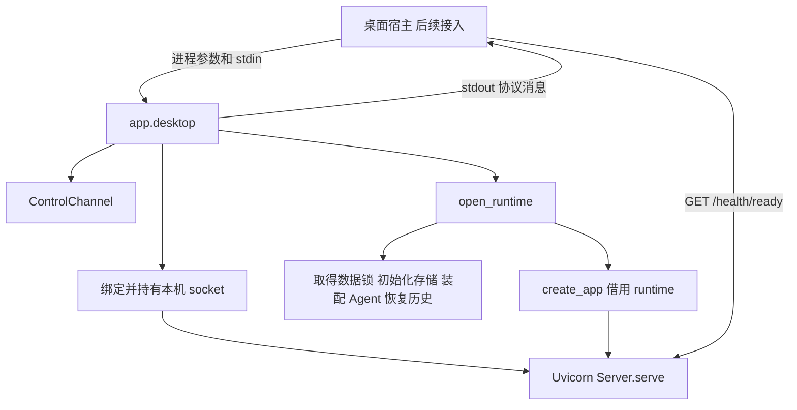
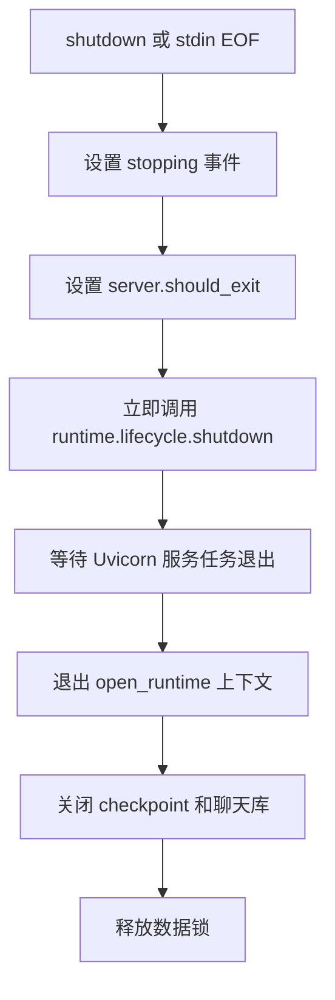

# 第 03 票实施说明 通过控制管道管理 Python 后端

日期：2026-09-30。对应任务：[03-controlled-python-backend.md](../.scratch/windows-backend-lifecycle/issues/03-controlled-python-backend.md)。

本次增加了一个供桌面宿主调用的 Python 入口。宿主可以通过进程管道获知端口、请求退出，再通过 HTTP 确认后端就绪。本文解释这些改动在系统中的位置、设计原因和实际使用的 API，方便你沿着代码阅读。

第 03 票完成的是 Python 一侧。Tauri 自动启动后端、Windows Job 管理进程树、超时强制回收等能力仍由后续票实现。本文中的测试结果引用本轮实施记录，编写说明时没有重新运行测试。

后续进度（2026-10-02）：第 04～07 票现已实现桌面托管、初始化取消、有界退出、故障后的手动重试及桌面单实例。本文保留第 03 票的实施背景及历史测试结果；当前退出行为见[第 05 票记录](../.scratch/windows-backend-lifecycle/issues/05-bounded-shutdown-reclamation.md)，重试接口与隔离见[第 06 票记录](../.scratch/windows-backend-lifecycle/issues/06-manual-retry-isolation.md)，重复打开、窗口恢复及竞争保护见[第 07 票记录](../.scratch/windows-backend-lifecycle/issues/07-single-desktop-instance.md)。

## 1 为什么需要独立的桌面入口

手动运行 HTTP 服务时，开发者可以看终端日志、决定何时访问、何时停止。桌面应用需要用程序完成这些判断：后端启动到了哪一步、应该连接哪个端口、是否可以发送业务请求、退出时如何释放资源。

因此新增 `python -m app.desktop`，让桌面宿主与 Python 后端有明确的通信约定。

| 通道 | 内容 | 使用方 |
| --- | --- | --- |
| stdin | `shutdown` 控制消息 | 宿主发送，Python 接收 |
| stdout | `bound` 或 `startup_error` | Python 发送，宿主解析 |
| stderr | 普通日志和异常堆栈 | 宿主收集，用于诊断 |
| HTTP | 就绪检查、Thread、Run、SSE | 宿主探测，业务客户端调用 |

stdin/stdout 是创建子进程时连接的标准输入输出管道，不需要额外开放一个控制端口。

## 2 它在整体架构中的位置



这次沿用了前两票提供的基础：

- 第 01 票让 `create_app(runtime=runtime)` 可以借用外部 runtime；HTTP lifespan 不再重复装配它。
- 第 02 票让 `open_runtime()` 在初始化前取得数据独占权，关闭数据库后再释放锁。
- 第 03 票由桌面入口持有这份 runtime，并协调 HTTP 服务和控制管道。

资源归属可以记成：**桌面入口拥有 runtime 和服务生命周期，HTTP 路由使用 runtime 提供的业务能力。**

## 3 改了哪些文件

| 文件 | 做什么 | 为什么放在这里 |
| --- | --- | --- |
| [app/desktop.py](../app/desktop.py) | 解析参数、加载环境与配置、绑定端口、运行 HTTP、协调退出 | 集中处理桌面入口的生命周期 |
| [app/desktop_control.py](../app/desktop_control.py) | 编解码控制消息，读取 stdin，把停止请求交给事件循环 | 将协议与业务服务装配分开 |
| [app_config.py](../packages/harness/shikigen/app_config.py) | 增加 `BackendConfig`，调整配置错误输出 | 共享配置仍由统一入口校验 |
| [tests/test_desktop.py](../tests/test_desktop.py) | 从真实进程管道和 HTTP 检查行为 | 能验证进程退出、端口和网络服务的实际协作 |
| [tests/desktop_process.py](../tests/desktop_process.py) | 启动真实桌面入口，替换模型边界并注入指定 socket 故障 | 避免测试访问真实模型，稳定复现端口错误 |
| [tests/test_app_config.py](../tests/test_app_config.py) | 验证严格配置规则与错误信息 | 防止配置被隐式转换或错误回显密钥 |

任务索引、验收记录和完整测试日志也已更新。本票复用现有依赖；`app/server.py`、共享 runtime 和 CLI 的实现没有在本票修改。

## 4 启动流程怎么走

### 入口参数

开发态宿主在项目根目录启动虚拟环境中的 Python，传入以下参数：

```text
.venv\Scripts\python.exe -m app.desktop --config C:\code\shikigen-agent\config.json --startup-id example-start-001 --port 43127
```

这是宿主调用接口示例。启动真实配置会初始化其中的模型、工具和数据库；自动测试使用隔离临时数据和确定性 Agent。

| 参数 | 含义 |
| --- | --- |
| `--config` | 本次要读取的配置路径，宿主约定传绝对路径 |
| `--startup-id` | 本次启动标识，用于关联消息和健康响应 |
| `--port` | 本次尝试绑定的起始端口 |

`startup_id` 用来区分不同启动轮次，不承担身份认证。三个参数当前都必须显式传入。

### 从进程创建到 HTTP 可用

1. `main()` 保存协议输出句柄，把普通 stdout 转到 stderr，解析参数。
2. `run()` 调用 `control.start()`，先建立 stdin 读取线程。
3. 从入口模块位置找到项目根 `.env`，执行 `load_dotenv(..., override=False)`，然后调用 `load_app_config()`。
4. `bind_listener()` 找到可用端口，保留成功绑定的 socket，输出 `bound`。
5. 进入 `open_runtime(config)`，完成数据独占、存储初始化、Agent 装配和历史恢复。
6. 调用 `create_app(runtime=runtime)`，添加桌面模式的健康接口。
7. 用 `uvicorn.Server.serve(sockets=[listener])` 启动服务，宿主此时才能取得就绪响应。

`override=False` 表示已有进程环境变量优先，`.env` 只补充缺失值。环境文件不存在时可以继续；配置引用的必要变量缺失时，错误给出变量名和配置位置。

### 端口为什么要一直持有

如果先探测一个空闲端口，再关闭探测 socket，之后让 Uvicorn 重新绑定，中间可能被其他进程抢占。因此本实现把成功绑定的同一个 socket 直接交给 Uvicorn。

| 情况 | 处理 |
| --- | --- |
| 地址 | 只绑定 IPv4 `127.0.0.1` |
| Windows 独占 | 绑定前设置 `SO_EXCLUSIVEADDRUSE` |
| 端口占用 | 尝试下一个端口 |
| Windows 10013 | 记录原始原因，继续尝试 |
| 其他绑定错误 | 立即失败 |
| 到达 65535 仍失败 | 报端口耗尽，不回绕 |

托管 Uvicorn 使用单 worker 并关闭 reload，保持本次启动只有一个明确的服务生命周期。

## 5 bound 和 ready 分别说明什么

绑定成功时，stdout 会输出一行：

```json
{"version":1,"startup_id":"example-start-001","type":"bound","port":43127}
```

此时 runtime 可能仍在初始化，HTTP 也可能尚未开始接收连接。宿主拿到端口后还需要探测 `GET /health/ready`，并核对 HTTP 200、版本和启动标识。

就绪响应示例：

```json
{"version":1,"startup_id":"example-start-001","status":"ready"}
```

当前实现是在 runtime 初始化和恢复完成后才启动 HTTP，所以初始化期间通常表现为连接不可用。进入停止状态后，如果健康请求仍能到达处理函数，会返回 HTTP 503。

健康检查读取的是服务状态，不会额外向模型发送生成请求。这个接口只在桌面入口组装的应用上添加。

## 6 控制协议如何工作

### 消息格式

控制通道采用 UTF-8 JSON Lines：每条消息是一行 JSON，末尾必须有换行。单条消息最多 64 KiB，包含终止换行。

宿主请求关闭：

```json
{"version":1,"startup_id":"example-start-001","type":"shutdown"}
```

配置加载、绑定或运行入口发生异常时，错误消息形如：

```json
{"version":1,"startup_id":"example-start-001","type":"startup_error","code":"AppConfigError","message":"错误字段与原因"}
```

目前 `code` 使用异常类型名，`message` 截取前 4000 个字符；堆栈输出到 stderr。消息发送后立即 flush，让宿主及时读到。

### 读取和校验

`ControlChannel.start()` 启动一个 daemon 线程执行阻塞读取，再通过 `loop.call_soon_threadsafe()` 把停止意图交给 asyncio 事件循环。线程负责读管道，事件循环负责后续异步清理。

读取使用 `readline(MAX_MESSAGE_BYTES + 1)`，在读取阶段就限制长度。超过上限且一直不换行的输入，也能被拒绝。

校验按以下顺序进行：

1. 检查消息长度和末尾换行。
2. 解码 UTF-8，解析 JSON，要求顶层为对象。
3. 要求 `startup_id` 为字符串；可解析且标识属于旧启动的消息直接忽略。
4. 当前启动的消息必须使用整数版本 `1`，且类型为 `shutdown`。

损坏的 JSON 无法被归类为旧消息。Python JSON 默认接受的 `NaN`、`Infinity` 等常量也被显式拒绝；布尔值 `true` 不会被当作版本整数 `1`。

协议错误记录到 stderr、设置停止事件，并让进程最终返回非零退出码。stdin EOF 也会设置停止事件，但正常 EOF 本身不算协议错误。

### 标准流处理解决了两个实际问题

**协议输出不能混入普通打印。** `main()` 用 `os.dup()` 保存专用输出描述符，再用 `os.dup2()` 把普通 stdout 导向 stderr。协议通过保存的描述符发送；测试验证了 Python `print` 和真实工具子进程输出都进入 stderr。

**启动失败不能等待 stdin 才退出。** 初版读取线程阻塞在标准输入缓冲区时，真实测试出现了解释器退出被卡住的问题。现在用独立、无缓冲的输入描述符读取，并使用 daemon 线程；也避免了默认 executor 在退出时等待一个始终未结束的 stdin 读取任务。

协议使用的独立描述符通过 `os.set_inheritable(..., False)` 标记为不可继承。

## 7 正常关闭的顺序

服务运行期间，入口同时等待两个任务：Uvicorn 服务任务，以及 `control.stopping.wait()`。任一结束后，进入清理流程。



`runtime.lifecycle.shutdown()` 停止接收新的生命周期操作，并清理已有执行。已有实现会复用同一个 shutdown 任务，因此入口显式调用后，runtime 上下文退出时再次调用仍可复用清理结果。

这里先发出 Uvicorn 停止意图，紧接着开始 runtime 清理。执行和流事件需要清理才能收尾，不能把“所有 SSE 都自然断开”作为开始清理 runtime 的前提。

第 03 票验收覆盖正常关闭和已完成的一轮 SSE；第 05 票进一步验证了持续 SSE、执行中关闭和清理卡住后的强制回收。手动 HTTP 和 CLI 不使用桌面 stdin EOF 规则。

## 8 配置与错误信息做了哪些调整

`AppConfig` 新增 `backend` 分组：

```json
{
  "backend": {
    "port": 43127,
    "startup_timeout_seconds": 60,
    "shutdown_timeout_seconds": 10
  }
}
```

这是配置片段。整组或字段省略时采用默认值。

| 字段 | 校验 |
| --- | --- |
| `port` | 1～65535 的整数 |
| `startup_timeout_seconds` | 大于 0 的有限数值 |
| `shutdown_timeout_seconds` | 大于 0 的有限数值 |

实现使用 Pydantic `ConfigDict(extra="forbid", strict=True)` 和 `Field` 约束，拒绝未知字段、显式 null、布尔值、数字字符串及非法范围。

第 03 票完成这些期限的配置接入和校验。现由 Rust 宿主读取并固定本次配置，将端口通过 `--port` 传给 Python，执行启动与退出总期限；强制回收再使用一次固定的 5 秒确认预算。

配置错误输出也作了调整。Pydantic 默认异常文字可能包含解析后的环境变量值，因此现在只整理字段位置与错误原因，并用 `raise ... from None` 抑制原始异常链。审查又发现 MCP `transport` 的错误原因本身会嵌入输入值，因此这类错误改为固定的安全说明。该调整针对配置校验错误，不代表所有运行日志都经过通用密钥过滤。

## 9 怎么证明这些行为有效

测试通过真实 Python 子进程启动真实 Uvicorn、runtime 和数据库。Agent 使用既有确定性 fixture，能够执行工具并产生 SSE，而不会访问真实模型。

| 验证类别 | 覆盖内容 |
| --- | --- |
| 启动和使用 | `bound`、匹配标识的健康响应、Thread 接口、一轮 Agent HTTP/SSE |
| 正常退出 | shutdown、EOF、启动失败时 stdin 仍打开也能退出 |
| 协议 | 非法 UTF-8/JSON、错误版本/命令、旧启动消息、超长输入、64 KiB 合法边界、缺换行 |
| 配置 | 默认值与非法值、环境文件加载/缺失、宿主变量优先、缺变量提示、错误不回显测试密钥 |
| Windows 实测 | 连续占用端口递增、服务端口不能被抢占、普通及子进程 stdout 隔离 |
| 故障注入 | socket 10013、10049、65535 耗尽；首次成功 bind 后禁止再次 bind，验证服务复用原 socket |

故障注入验证对应分支的行为，不等同于真实制造 Windows 保留端口或端口耗尽。

本轮最终结果：

- 全量 257 项测试，256 通过、1 跳过、0 失败，耗时 228.050 秒。
- 跳过项来自第 02 票：本机缺少 Windows 符号链接权限。
- 本票桌面集成测试 9 项、配置文件测试 24 项均通过。
- 类型检查、Ruff 和差异空白检查通过；两路审查发现的配置回显问题修复后，剩余发现为 0。

详见[验收记录](../.scratch/windows-backend-lifecycle/issues/03-controlled-python-backend.md)和[完整测试日志](../.scratch/windows-backend-lifecycle/test-results-03.log)。

## 10 当前边界与建议阅读顺序

第 05 票让 `serve_backend()` 同时等待 runtime 生命周期任务和控制停止事件。初始化期间可取消上下文进入并释放已有资源；运行期间先停止执行，再等待 HTTP 收尾。同步阻塞或不响应取消的路径由 Rust 的总期限与 Job 强制回收处理。

桌面宿主启动、就绪探测、Windows Job、统一期限、进程树强制回收、手动重试和单实例已实现。后续仍有托盘、业务客户端切换和日志查询；当前没有 macOS 原生验收。

建议按以下顺序阅读代码：

1. `app/desktop.py` 的 `run()`：先看整个启动流程。
2. 同文件的 `serve_backend()`：看 runtime、HTTP 与退出之间的所有权关系。
3. `app/desktop_control.py`：看线程如何把控制输入变成异步停止事件。
4. 回到 `main()`：理解标准流描述符的处理。
5. `tests/test_desktop.py`：从外部可观察行为对照实现。

读完应能解释这条链路：**宿主启动 Python → Python 报告端口 → runtime 完成恢复 → HTTP 确认就绪 → 宿主请求关闭 → 执行、服务、存储和锁依次收尾。**
