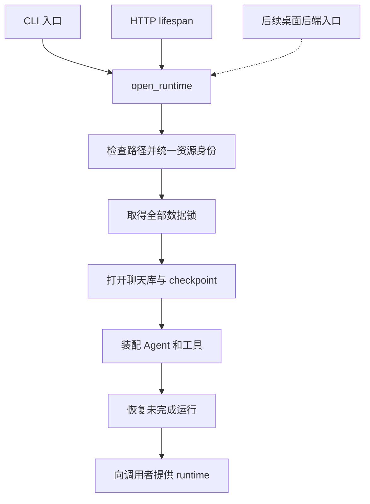

# 第 02 票实施说明：让多个入口安全争用运行数据

日期：2026-09-29。本文保留第 02 票的数据独占设计与当时验收；Windows 01～10 票已于 2026-10-02 收尾，后续票进度见 [收尾摘要](windows-backend-lifecycle.md)。对应任务：[02-exclusive-runtime-data.md](windows-backend-lifecycle.md#实施结果)。

这份文档解释本次已经完成的代码改动及其原因。验证结果来自本轮实施时的测试记录；编写本说明时没有重新运行测试。

## 1. 解决什么问题

CLI、手动 HTTP 和未来的桌面后端，都可能尝试打开同一套运行数据。数据包括聊天库，以及保存 Graph 执行进度的 SQLite checkpoint。

SQLite 自身的事务锁只管理数据库操作的并发，不能表达“这套运行数据当前由哪个 runtime 负责”。如果两个 runtime 同时启动，其中一个可能在恢复流程中处理另一个仍在运行的任务。因此，需要在打开数据库、执行恢复之前，取得覆盖整个 runtime 生命周期的独占权。

本次实现的规则是：**一个 runtime 必须先取得它需要的全部持久数据锁，才能初始化；取不到就立即失败。** 已经持有数据的 runtime 继续工作。

## 2. 在系统中的位置

锁放在共享的 `open_runtime()` 边界，所有使用这个入口的调用方都自动遵守同一规则。HTTP 路由、CLI 命令和每条消息的执行逻辑不需要各自管理进程锁。

### 生命周期顺序

| 阶段 | 顺序 |
| --- | --- |
| 启动 | 检查路径 → 取得全部锁 → 打开 ChatStore → 打开 checkpoint → 装配 Agent → 恢复 → 提供 runtime |
| 退出 | `runtime.lifecycle.shutdown()` → 关闭 checkpoint → 关闭 ChatStore → 解锁并关闭锁文件句柄 |
| 取锁失败 | 释放本次已经取得的锁，抛出异常；不初始化数据库、不执行恢复 |

`AsyncExitStack` 负责按注册顺序的逆序清理资源。锁最先注册，所以在正常资源退出过程中最后释放。

## 3. 修改了哪些文件

以下路径相对于仓库根目录。

| 文件 | 做了什么 | 为什么 |
| --- | --- | --- |
| `packages/harness/shikigen/runtime/composition.py` | 在 `open_runtime()` 外层加入所有权上下文，使用 `AsyncExitStack` 管理资源 | 让所有共享入口遵守一致的取得与释放顺序 |
| `packages/harness/shikigen/runtime/data_ownership.py`（新增） | 封装锁集合、取锁失败回滚、争用异常和句柄清理 | 把进程级所有权集中在一个模块 |
| `packages/harness/shikigen/runtime/data_paths.py`（新增） | 校验路径及父目录，解析最终路径，计算资源身份 | 防止不同路径名称绕过同一资源的争用检查 |
| `packages/harness/pyproject.toml` | 增加 `portalocker==3.2.0`、Windows 条件依赖 `pywin32>=306` | 使用任务规定的原生锁实现 |
| `pyproject.toml` | 增加开发依赖 `types-pywin32` | 对 Windows API 调用进行类型检查 |
| `uv.lock` | 更新依赖解析记录 | 保存本次依赖变更 |
| `tests/test_runtime_data.py`（新增） | 增加 16 项所有权、路径和生命周期测试 | 从共享 runtime 边界验证行为 |
| `tests/runtime_data_worker.py`（新增） | 提供真实子进程测试入口 | 验证 Windows 跨进程锁和句柄继承行为 |
| `.scratch/windows-backend-lifecycle/issues/02-exclusive-runtime-data.md` | 写入实现、验收与未验证场景，标记 `done` | 留下任务完成依据 |
| `.scratch/windows-backend-lifecycle/README.md` | 记录 01、02 完成，当前 frontier 更新为 03 | 更新任务依赖进度 |
| `.scratch/windows-backend-lifecycle/test-results-02.log`（新增） | 保存全量测试原始输出 | 方便复查具体用例与结果 |

## 4. 锁具体怎么工作

### 4.1 使用稳定的旁路锁文件

数据库 `chat.db` 对应旁路文件 `chat.db.runtime.lock`。应用在旁路文件上持有操作系统原生锁。

- Windows 显式使用 `portalocker.portalocker.Win32Locker`，不修改 Portalocker 的全局锁后端。
- 调用 `locker.lock(file, LockFlags.EXCLUSIVE | LockFlags.NON_BLOCKING)`：独占，且争用时立即返回失败。
- 捕获 `AlreadyLocked`，转换为 `RuntimeDataInUse`，错误消息包含具体数据路径。
- 其他 I/O 错误保留原原因，便于区分争用、权限和文件系统故障。

**锁文件存在不代表数据被占用。** 占用依据是操作系统是否允许取得锁。因此，解锁后保留旁路文件，下一次继续使用它；异常退出后，也必须实际重新取得原生锁才能启动。

保留稳定文件还能避免解锁时删除文件、随后出现不同进程锁住不同文件对象的问题。`.runtime.lock` 后缀保留给锁文件，不能用作数据库文件名。

### 4.2 一次取得全部资源

聊天库和 SQLite checkpoint 分别属于需要独占的资源：

| 配置情况 | 行为 |
| --- | --- |
| 聊天库与 checkpoint 指向同一实际文件 | 去重后只持有一把锁 |
| 指向不同数据库文件 | 两把锁都取得后才能初始化 |
| checkpoint 使用内存后端 | 只锁聊天库，忽略 checkpoint 配置中未使用的路径 |
| 第二把锁被其他 runtime 占用 | 立即释放本次已取得的第一把锁，启动失败 |

资源按统一后的路径排序，使用 `ExitStack` 管理回滚。既有文件按文件身份去重；尚未创建的数据库还会借助实际打开的旁路文件身份去重。

实施中曾发现一个边界问题：新数据库的 `Case.db` 与 `case.db` 在普通 Windows 目录中指向同一个文件，但数据库尚不存在，无法直接取得其文件身份。补充旁路文件身份去重后，这种配置不会再重复锁住自己。

### 4.3 不把所有权传给工具子进程

打开旁路文件后调用 `os.set_inheritable(file.fileno(), False)`，明确禁止继承锁句柄。

测试中专门启动了允许继承句柄的工具子进程，并让它在 runtime 退出后继续存活。后继 runtime 仍能取得数据锁，验证工具子进程不会拖延所有权释放。

## 5. 为什么要单独处理路径身份

同一资源可能有相对路径、绝对路径、大小写或 Windows 8.3 短文件名等不同写法。只比较路径字符串，可能误判为不同资源。

`resolve_data_path()` 的处理流程是：

1. 展开用户目录，检查 Windows 路径语法和驱动器类型。
2. 使用 `lstat()` 检查原始路径及所有父目录，先发现链接，再解析最终路径。
3. 使用 `Path.resolve()` 统一最终路径，并再次检查。
4. 必要时创建父目录；这个阶段可能创建目录，但不会初始化数据库。
5. 已存在的文件用 `(st_dev, st_ino)` 表示身份；尚不存在的文件使用父目录身份和文件名。
6. 锁文件打开后，再用 `os.fstat()` 获取实际文件身份。

当前 Windows 实现明确拒绝：

- 硬链接，以及符号链接、目录联接等重解析点，包括位于父目录中的链接。
- UNC 网络共享、设备路径和映射网络驱动器。
- 驱动器相对路径，例如 `C:relative.db`。
- 带备用数据流语法、尾随空格或点、保留名称等歧义 Windows 文件名。
- 非普通文件。

归一后的数据库路径写入配置副本，调用者传入的 `AppConfig` 不被修改。

## 6. 调用方需要知道的 API

| API / 异常 | 调用方应如何理解 |
| --- | --- |
| `open_runtime(config)` | 继续作为完整 runtime 入口；进入上下文时取得所有权，退出时释放 |
| `own_runtime_data(config)` | 供装配层使用的同步上下文管理器；取得全部锁并提供归一后的配置 |
| `resolve_data_path(value)` | 平台路径检查及资源身份边界 |
| `RuntimeDataInUse` | 请求的数据正被另一个 runtime 占用，本次启动未取得全部所有权 |
| `UnsupportedRuntimeDataPath` | 数据路径超出当前支持范围，继承自 `ValueError` |

同一个 runtime 内可以有多个业务 Thread，它们共享 runtime 所有权，不会每条消息重新争用进程锁。

这个保证建立在使用 `open_runtime()` 的前提上。直接使用 `ChatStore.open()`，或者用 `assemble_runtime()` 装配调用者自行提供的依赖，仍由调用者负责资源与所有权管理。

## 7. 如何验证

### 测试方式

按行为逐步补测试：先看到失败，再实现对应能力。已观察到的失败包括“第二个 runtime 居然能打开同库”“硬链接被接受”“新文件大小写别名重复取锁”；实现后对应测试通过。

子进程测试使用真实 Windows 进程、SQLite 和原生锁。模型替换成确定性测试 Agent，使测试不依赖真实模型请求。连接关闭顺序测试会暂缓 SQLite 连接的关闭，再从其他进程尝试启动，检查锁是否仍然有效。

### 已验证的关键场景

- 同库争用、仅部分数据库重叠、不同数据库同时使用。
- 取锁失败回滚，失败入口未创建数据库，原持有者仍能运行两个 Thread。
- 强杀持有进程后重新取得锁，残留旁路文件可继续使用。
- 工具子进程仍存活时，runtime 退出后释放所有权。
- 两条数据库连接关闭期间继续拒绝争用，关闭完成后后继 runtime 可启动。
- 初始化取消后可重新启动。
- 相对路径、大小写与 8.3 短文件名别名。
- 硬链接数据文件、硬链接锁文件、目录联接父目录，以及不支持的路径语法。
- 内存 checkpoint 不锁定未使用的持久化路径。

### 本轮结果

| 检查 | 结果 |
| --- | --- |
| 专项测试 `test_runtime_data.py` | 16 项：15 通过、1 跳过，36.623 秒 |
| 全量 `python -m unittest discover -s tests -v` | 245 项：244 通过、1 跳过，无失败，158.798 秒 |
| `ty check app packages/harness` | 通过 |
| 改动文件 Ruff 检查、格式检查 | 通过 |
| `git diff --check` | 通过 |
| Standards / Spec 两路审查 | 各 0 项发现 |

原始输出：[test-results-02.log](archive/README.md#windows-历史与验收)。

跳过的是符号链接实测：当前 Windows 账户没有创建符号链接的权限。目录联接、硬链接和 8.3 短文件名测试实际通过。第 01 票曾记录的审批恢复超时用例本轮通过；本次没有修改该逻辑，不能据此认定历史问题已修复。

## 8. 适用边界与后续工作

- 真实网络共享和映射网络盘未接入验收；当前测试验证了 UNC 等路径语法的拒绝。
- 非 Windows 分支使用 `PosixLocker`，但 POSIX/macOS 原生行为未在本轮验收；Windows 的平台结论不能直接外推。
- 数据目录须由应用使用者管理，运行期间不可由外部程序替换、重命名或删除数据及旁路文件。本次检查不作为防御恶意并发文件系统修改的安全边界。
- Windows Job、后端控制管道、托盘和桌面启动状态机属于后续任务。第 02 票提供了它们需要的数据所有权基础。
- 本轮没有暂存、提交或修改 Git 索引。当前任务索引中 01、02 已完成，可继续推进 03。
